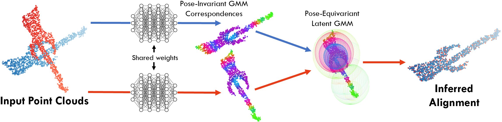

## DeepGMR: Learning Latent Gaussian Mixture Models for Registration
#### [[paper]](https://arxiv.org/abs/2008.09088) [[data]](https://drive.google.com/drive/folders/1Wb0gQf-9_9zmUawxl3cGwG9rDSjTDojK) [[website]](https://wentaoyuan.github.io/deepgmr)


### Introduction
Deep Gaussian Mixture Registration (DeepGMR) is a learning-based probabilistic point cloud registration algorithm which achieves fast and accurate global regitration. This repository contains a basic PyTorch implementation of DeepGMR. Please refer to our [project website](https://wentaoyuan.github.io/deepgmr) or our [publication at ECCV 2020](https://arxiv.org/abs/2008.09088) for more details.

If you find our work useful, please consider citing our paper:
```
@inproceedings{yuan2020deepgmr,
  title        = {DeepGMR: Learning Latent Gaussian Mixture Models for Registration},
  author       = {Yuan, Wentao and Eckart, Benjamin and Kim, Kihwan and Jampani, Varun and Fox, Dieter and Kautz, Jan},
  booktitle    = {European Conference on Computer Vision},
  pages        = {733--750},
  year         = {2020},
  organization = {Springer}
}
```

### Usage
#### Prerequisite
1. Install dependencies by `conda create -f environment.yml -n deepgmr`.
2. Download [data](https://drive.google.com/drive/folders/1Wb0gQf-9_9zmUawxl3cGwG9rDSjTDojK) to `data/`.
3. Download [pre-trained models](https://drive.google.com/drive/folders/1_1Hme82PkecLXhAq00LeQ4s8PXAltTH3) to `models/` (optional).

#### Inference
We provide four datasets for benchmarking registration results: `modelnet_clean.h5`, `modelnet_noisy.h5`, `modelnet_unseen.h5` and `icl_nuim.h5` (see Sec. 5 of our paper for more details). Each HDF5 file contains pairs of source and target point clouds with ground truth transformations. The transformations are fixed for ease of comparison.

Download the pre-trained models to reproduce the results of DeepGMR in the paper. For example, to see results on ModelNet noisy, run
```
python test.py --data data/test/modelnet_noisy.h5 \
--checkpoint models/modelnet_noisy.pth \
--use_rri \
--save_results \
--results_dir log/modelnet_noisy/test
```
and the predicted transformations will be saved at `log/modelnet_noisy/test`.

#### Training
Training DeepGMR is simple. For example, to train on ModelNet unseen:
```
python train.py --data data/train/modelnet20.h5 \
--log_dir log/modelnet_unseen/train \
--use_rri
```
Note that we use point clouds from only the first 20 classes of ModelNet40 (`modelnet20.h5`) instead of the full ModelNet40 (`modelnet40.h5`) to test the generalizability of our model to point clouds form unknown categories.

Ground truth transformations for the training/validation data are generated on the fly, whose magnitude can be controlled by `--max_angle` and `--max_trans`. The `--clean` flag controls whether independent Gaussian noise is added to the input points. Visualizations of the registration results will be available on Tensorboard during training.
